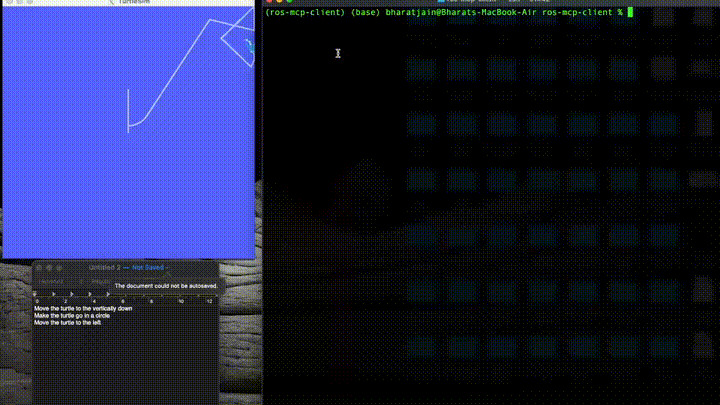

# ROS MCP Client 🧠⇄🤖


<p align="center">
  
</p>

The **ROS MCP Client** is a reference implementation of a Model Context Protocol (MCP) client, designed to connect directly with [ros-mcp-server](https://github.com/robotmcp/ros-mcp-server/).

Instead of using a Desktop LLM client, it acts as a bridge that integrates an LLM, enabling natural-language interaction with any ROS or ROS2 robot.

## 🧠 What It Does

`ros-mcp-client` implements the LLM-side of the MCP protocol.

It can:
- Connect to a `ros-mcp-server` over MCP (stdio or HTTP).
- Send natural language queries or structured requests to the robot without the need to integrate it with a Desktop LLM client
- Stream back feedback, sensor data, or responses from the server.
- Integrate with a multiple LLM providers including OpenAI, Antropic, Gemini, qwen, gpt-oss and other local LLM (Gemini, Ollama, Nvidia NeMo).

In short, it lets you run an MCP-compatible client that speaks to robots via the MCP interface — useful for testing, local reasoning, or autonomous AI controllers.

<p align="center">
  
</p>

---

## ⚙️ Key Features of the ROS MCP Client

- Implements MCP client specification — plug-and-play with the ROS MCP server.

- ROS-aware LLM interface — specialized prompts and handlers for robotics tasks.

- Supports bidirectional streaming — send commands, receive real-time topic feedback.

- LLM integration ready — use Gemini, Anthropic, or Ollama APIs as reasoning engines.

- Offline-capable — works entirely within local or LAN environments.

---

## 

## 🛠 Getting Started  

The MCP client is version-agnostic (ROS1 or ROS2).  

<p align="center">
  
</p>  

### Prerequisites

- ROS or ROS2 running with `rosbridge`
- Active [`ros-mcp-server`](https://github.com/robotmcp/ros-mcp-server) instance

### Installation  

1. Clone the repository  
```bash
git clone https://github.com/robotmcp/ros-mcp-client.git
cd ros-mcp-client
```

2. Install dependencies
```bash
uv sync  # or pip install -e .
```

3. Minimal setup for custom MCP client
```bash
./setup.sh
# Then edit .env and set:
# - ROS_MCP_SERVER_PATH=/absolute/path/to/ros-mcp-server
# - LLM_PROVIDER=gpt-oss|openai|anthropic|ollama
```

4. Run the base client
```bash
uv run clients/baseclient.py
```

5. Start `rosbridge` on the target robot
```bash
ros2 launch rosbridge_server rosbridge_websocket_launch.xml
```  

---

## 📁 Project Structure

```
ros-mcp-client/
├── .github/
│   └── workflows/
│       └── test-setup.yml    # CI for cross-platform setup
├── clients/
│   ├── baseclient.py         # Multi-LLM MCP client (LangGraph)
│   ├── llm_store.py          # LLM provider configuration
│   └── gemini_live/          # Gemini Live client
│       ├── gemini_client.py  # Main client script
│       ├── mcp.json          # MCP server configuration
│       ├── setup_gemini_client.sh  # Automated setup
│       └── README.md         # Detailed setup guide
├── .env                      # Environment config (not tracked)
├── setup.sh                  # Cross-platform setup script
├── pyproject.toml            # Python dependencies
└── README.md                 # This file
```

---

## 📚 Available Clients  

The project includes multiple LLM client implementations:

### 🤖 **Base MCP Client** (`clients/baseclient.py`)
Multi-provider LLM client with support for:
- **OpenAI**: GPT-4.1
- **Anthropic**: Claude Sonnet 4.5
- **Google Gemini**: Gemini 2.5 Flash Lite
- **Cerebras** (open-source models):
  - Llama 4 Scout 17B
  - Llama 3.1 8B
  - Llama 3.3 70B
  - OpenAI GPT-OSS 120B
  - Qwen 3 32B

**Configuration**: Set `LLM_PROVIDER` in `.env` (see setup.sh)

#### Supported Models

| Provider | Keyword | Parameters |
|----------|---------|------------|
| **Proprietary Models** | | |
| Google Gemini 2.5 Flash Lite | `gemini` | - |
| OpenAI GPT 4.1 | `openai` | - |
| Anthropic Claude Sonnet 4.5 | `claude` | - |
| **Cerebras (Open Source)** 
| Llama 4 Scout | `llama-scout` | 109B |
| Llama 3.1 8B | `llama-8b` | 8B |
| Llama 3.3 70B | `llama` | 70B |
| OpenAI GPT OSS | `gpt-oss` | 120B |
| Qwen 3 32B | `qwen` | 32B |

**Usage**: Set `LLM_PROVIDER=<keyword>` in your `.env` file (e.g., `LLM_PROVIDER=llama-scout`)

### 🎤 **Gemini Live Client** (`clients/gemini_live/`)
- **Full-featured** Google Gemini integration
- **Text-only mode** optimized for WSL
- **Real-time interaction** with ROS robots
- **Automated setup** with `setup_gemini_client.sh`

### 🚀 **Quick Start**
```bash
# Multi-provider base client
./setup.sh
# Edit .env: set ROS_MCP_SERVER_PATH and LLM_PROVIDER
uv run clients/baseclient.py

# Gemini Live client
cd clients/gemini_live
./setup_gemini_client.sh
uv run gemini_client.py
```

We welcome community PRs with new client implementations and integrations!  

---

## 🤝 Contributing  

We love contributions of all kinds:  
- Bug fixes and documentation updates  
- New features (e.g., Action support, permissions)  
- Additional examples and tutorials  

Check out the [contributing guidelines](docs/contributing.md) and see issues tagged **good first issue** to get started.  

---

## 📜 License  


This project is licensed under the [Apache License 2.0](LICENSE).  

agged **good first issue** to get started.  